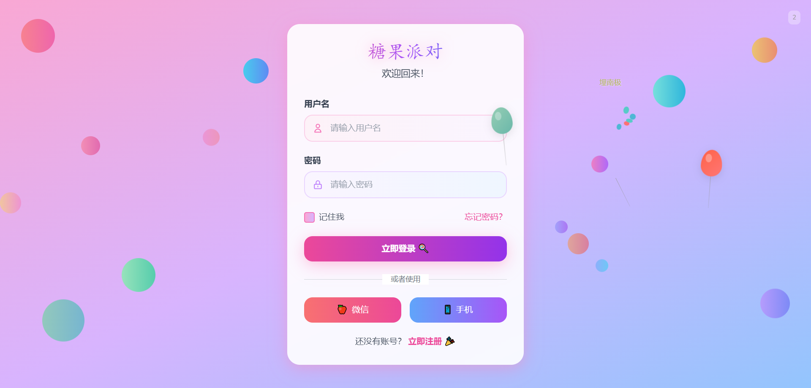
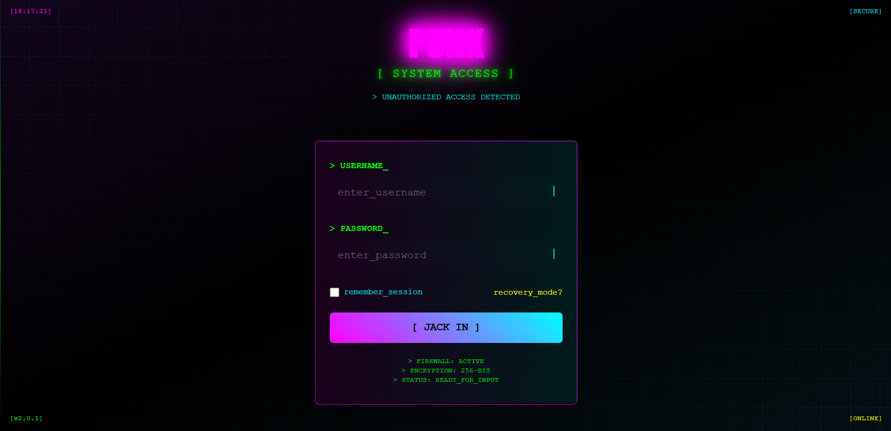

# 🍭 糖果派对登录页面


一个充满趣味和互动的卡通风格登录页面，采用糖果派对主题设计，提供多种有趣的交互效果和动画。

**🌐 在线预览：[糖果派对登录页面](https://a97242689.github.io/fun-login-page/)**

**📖 英文文档：[English Documentation](README-EN.md)**





## 🎨 项目特色

### 视觉风格
- **糖果主题设计**：采用粉色、紫色、蓝色渐变背景，营造梦幻糖果世界
- **卡通字体**：使用 `Fredoka One` 和 `Nunito` 字体，呈现活泼可爱的视觉效果
- **毛玻璃效果**：登录表单采用半透明背景和模糊效果，现代感十足
- **渐变配色**：丰富的渐变色彩搭配，从粉色到紫色再到蓝色的自然过渡

### 交互效果
- **鼠标跟随元素**：背景中的糖果装饰会随鼠标移动产生跟随效果
- **浮动动画**：页面元素具有轻柔的上下浮动动画
- **悬停反馈**：所有可交互元素都有平滑的悬停过渡效果

## 🎈 气球系统

### 核心玩法
气球系统是本项目的核心特色，提供了丰富的交互体验：

#### 1. 气球生成
- **随机出现**：每3-7秒随机生成气球，70%概率触发
- **多样配色**：8种不同的渐变色彩组合
- **自然动画**：从屏幕底部缓缓上升，模拟真实气球的飘动效果
- **风向效果**：随机的水平偏移和轻微旋转，增加真实感

#### 2. 气球交互
**悬停暂停**
- 鼠标悬停时气球暂停上升
- 离开后继续原有的飘动轨迹

**拖拽功能**
- 单击并拖拽气球到任意位置
- 释放后以固定速度继续上升
- 平滑的位置过渡和状态切换

**双击爆炸**
- 双击气球触发爆炸效果
- 气球本体消失，产生多个彩色碎片
- 气球线绳以5种不同轨迹落下
- 显示随机惊喜文字效果

#### 3. 惊喜文字系统
气球爆炸后会随机显示以下类型的文字：
- **网络用语**：666、老铁好、YYDS、栓Q等
- **糖果词汇**：棒棒糖、甜甜圈、马卡龙、巧克力等
- **情感表达**：开心、惊喜、完美、给力等
- **搞笑内容**：埋南极、埋北极、鸡你太美、奥里给等

## 🎯 性能优化

### 动画优化
- **帧率控制**：鼠标跟随效果限制在60fps
- **事件节流**：鼠标事件使用16ms的节流机制
- **动态事件绑定**：拖拽事件只在需要时添加，结束后立即移除

### 内存管理
- **元素限制**：最多同时存在8个气球，防止内存堆积
- **自动清理**：所有动态元素都有定时清理机制
- **优化回调**：使用箭头函数和合理的闭包避免内存泄漏

## 📱 响应式设计

- **移动端适配**：完美支持手机和平板设备
- **弹性布局**：使用Flexbox实现自适应布局
- **触摸优化**：针对触摸设备优化的交互体验
- **视窗适配**：动态适应不同屏幕尺寸

## 🎮 气球玩法

1. **悬停暂停**：将鼠标悬停在气球上暂停其上升
2. **拖拽移动**：单击并拖拽气球到想要的位置
3. **双击爆炸**：快速双击气球观看爆炸效果
4. **查看计数**：在右上角查看扎破的气球总数


## 🎨 自定义配置

### 气球配置
```javascript
const balloonConfig = {
    colors: [
        ['#ff6b6b', '#ff8e8e'], // 红色渐变
        ['#4ecdc4', '#45b7aa'], // 青色渐变
        // ... 更多颜色
    ],
    stringAnimations: [
        'string-falling-1', 'string-falling-2', 
        // ... 5种不同的线绳掉落动画
    ],
    surpriseTexts: [
        '我炸了', '666', '老铁好',
        // ... 56种惊喜文字
    ]
};
```

### 性能参数
- 最大气球数量：8个
- 气球生成间隔：3-7秒
- 鼠标跟随帧率：60fps
- 动画持续时间：2-3秒

## 🌟 项目亮点

1. **创新交互**：独特的气球游戏化设计，提升用户参与度
2. **视觉享受**：精美的糖果主题设计，色彩丰富协调
3. **性能优秀**：多项优化措施，保证流畅的用户体验
4. **响应式**：完美适配各种设备和屏幕尺寸
5. **易扩展**：模块化的代码结构，便于功能扩展
6. **细节丰富**：从微动画到音效提示，注重用户体验细节

## 📄 文件结构

```
candy-login.html    # 主页面文件，包含完整的HTML、CSS、JavaScript代码
README.md          # 项目说明文档
```

## 🚀 快速开始

1. 下载项目文件
2. 在浏览器中打开 `candy-login.html`
3. 开始享受糖果派对的乐趣！

---

*享受这个充满乐趣的糖果世界吧！🍬✨*